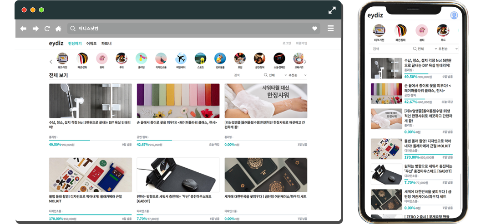

# 🎁 이디즈

## 국내 최대 크라우드 플랫폼 와디즈 클론하기!!!

  

# 데모

[Go to the Website](http://java.sannim.com/eydiz)

[PC Browser Mockup - Designed by Grapheberry](https://www.graphberry.com/item/flat-browser-mockup/)

[Mobile Mockup - Designed by Freepik](https://freepik.com)

## 참고 사이트

[와디즈](https://www.wadiz.kr)

## 목차

1. 특징

2. 사용 기술

## 특징

- Java 코드에서 자주 사용되는 변수는 인터페이스에 상수로 선언하여 참조하였습니다.
- Spring의 MVC2 패턴을 이용하여 AOP, 트랜잭션 처리, DI를 사용하였습니다.
- Spring의 DI 패턴을 적용하여 의존관계를 최소화하였습니다.
- Tiles 3의 템플릿 엔진을 이용하여 레이아웃이 반복적으로 사용되는 구간의 중복을 최소화하였습니다.
- Ajax를 이용하여 비동기 통신으로 데이터 요청을 최소화하였고, Promise를 이용하여 코드의 가독성을 높였습니다.
  (단, IE에서도 사용이 가능하도록 open source인 bluebird의 라이브러리를 함께 사용하였습니다.)
- 웹 표준 마크업을 지향하고자 HTML5, CSS3를 이용하여 웹 문서를 작성하였습니다.
- 카카오페이, 카카오 맵을 이용하여 Open API를 사용하였습니다.
- Outer JOIN을 이용하여 펀딩금액(취소금액 및 결제 금액) 계산 등 복잡한 다중 조인 연산을 수행했습니다.
  (결제여부와 취소여부를 알아야 하는 부분이 있으므로 해당하는 기능은 Outer Join을 사용하였습니다.)

## 사용기술

### FE

1. HTML5, CSS3, JS Legacy (IE 호환)
2. jQuery (DOM 관리, Ajax 작업 with Promise)
3. Tiles 3

### BE

1. Spring 4.3.27
2. Mybatis 3
3. Oracle 18c
4. Java

### Others

1. Git & Github
2. eXERD (DB 모델링)
3. Sql Developer (powered by Oracle)
4. STS 3.9
